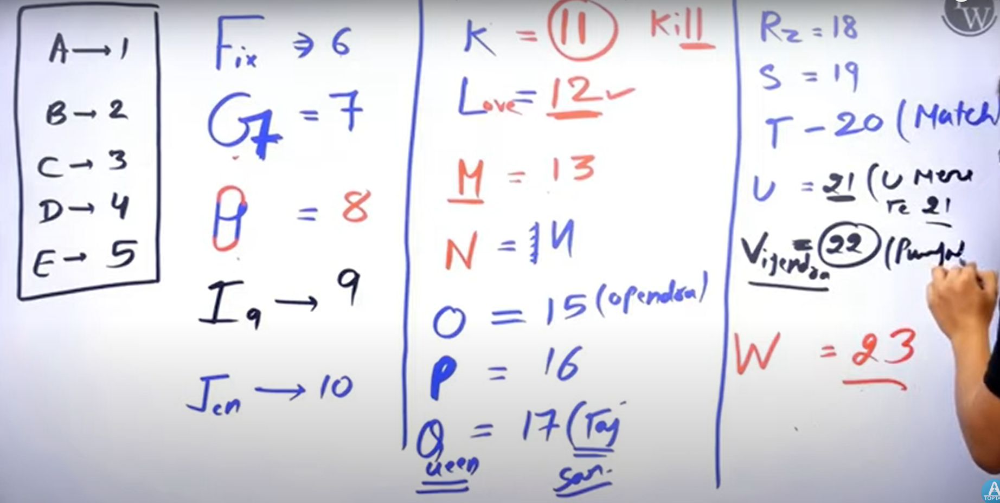

## Coding-Decoding

## Trick:

```
E J  O  T  Y
5 10 15 20 25
```



### 1. If in a certain code, FISH is written as GJTI, how is STAR written in that code?

- A) TUBS
- B) TUBQ
- C) TCBQ
- D) TUBR

**✅ Answer:** A) TUBS
**📘 Explanation:** Each letter is shifted +1: S→T, T→U, A→B, R→S

---

### 2. In a certain code, MONKEY is written as XDJMNL. How is TIGER written in that code?

- A) QDFHS
- B) SHFGS
- C) QDFHS
- D) UIDFS

**✅ Answer:** A) QDFHS
**📘 Explanation:** Reverse the word and shift letters: M→X, O→D, etc. (pattern-based)

---

### 3. In a certain language, 'CLOCK' is written as 'DMPDL'. How is 'WATCH' written in that code?

- A) XBVTI
- B) XDUFD
- C) XBZTI
- D) XBUDI

**✅ Answer:** D) XBUDI
**📘 Explanation:** Each letter is incremented by 1, so final code = 'XBUDI'

---
